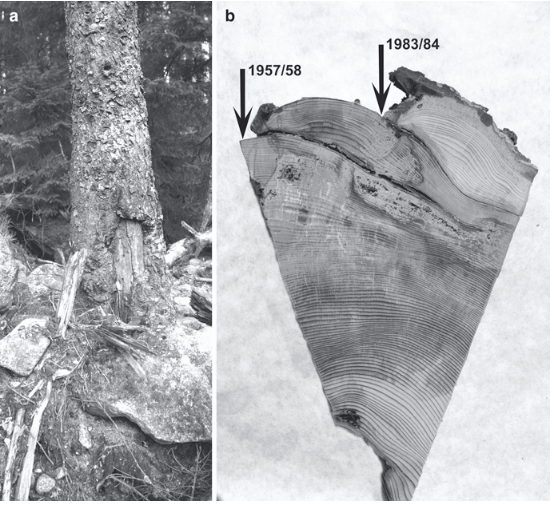

Stage Noémie
================
L Oudin
2026-02-05

# Rappel du sujet de stage

L’intensification et la fréquence croissante des événements
hydrologiques extrêmes constituent l’un des impacts majeurs attendus du
réchauffement climatique au XXIᵉ siècle. Pourtant, quantifier
l’évolution de ces extrêmes — qu’il s’agisse de crues ou de sécheresses
— demeure difficile, en raison de la forte variabilité naturelle du
climat et du manque de longues séries d’observations directes. Pour
dépasser cette limite, deux approches méthodologiques complémentaires
existent. La première consiste à simuler le fonctionnement hydrologique
passé et futur des bassins versants à l’aide de modèles hydrologiques,
forcés par des observations météorologiques, des réanalyses ou des
scénarios climatiques. La seconde repose sur l’analyse de données
indirectes (« proxys ») permettant d’allonger les séries hydrologiques,
comme les cernes d’arbres, les carottes sédimentaires, ou encore les
marques laissées par les crues dans les paysages (laisses de crues) ou
les archives documentaires.

Si plusieurs travaux récents ont démontré l’intérêt des réanalyses
atmosphériques de longue durée pour reconstituer des séries
hydrologiques continues et explorer la variabilité naturelle des
extrêmes (Brigode and Oudin 2025), peu d’études ont encore combiné
modèles hydrologiques et proxys indépendants. Or, une telle combinaison
ouvre des perspectives nouvelles : elle permet à la fois d’évaluer la
cohérence entre archives naturelles ou anthropiques et séries simulées,
et de tester la robustesse des modèles hydrologiques lorsqu’ils sont
confrontés à des événements extrêmes parfois absents des observations
récentes.

Les inondations perturbent la croissance des arbres présents dans le lit
majeur des rivières, par des blessures liées à la charge sédimentaire
charriée par la rivière en crue ou simplement par la submersion des
troncs qui peuvent entraîner des réductions de croissance. Ainsi par des
études dendrogéomorphiques, il est possible de reconstituer la
temporalité d’événements historiques de crue sur plusieurs centaines
d’années.

<figure>

<figcaption aria-hidden="true">Figure 1 - Cicatrices d’inondation
typiques sur un tronc d’épicéa (a). La section transversale extraite du
tronc présente deux cicatrices d’inondation. La datation croisée
dendrochronologique (b) indique que les deux cicatrices se sont formées
en 1957/1958 et 1983/1984 (Zielonka, Holeksa, and Ciapała
2010).</figcaption>
</figure>

Zhong et al. (2023) ont combiné analyse dendrogéomorphique et
hydraulique pour dater et qualifié le caractère extrême de crues passées
sur la rivière Asco (Corse, France). Cette analyse permet de disposer
d’un catalogue de crues potentielles de 1759 à 2020.

L’objectif du stage est de confronter la chronique des crues déduite de
l’analyse dendrogéomorphique avec une série de débits simulés sur
l’Asco, obtenue grâce au modèle hydrologique GR4J forcé par la réanalyse
FYRE de précipitations et températures quotidiennes sur la période
1871–2012.

# Planning du stage

<iframe class="responsive-iframe" src="Title_files/planning_gantt.html" width="900" height="700" frameborder="0">

</iframe>

# Description détaillée des tâches

## Lecture d’articles en lien avec le stage

Pour la biblio, utilisation indispensable de
[Zotero](https://docs.zotero-fr.org/quick_start_guide/) . Cela sert à
créer une bibliothèque d’articles, à insérer correctement les références
dans le mémoire et à en faire la liste en fin de mémoire. Il faut
installer un plugin dans Word pour l’utiliser lors de l’écriture du
rapport.

[Les articles cités dans cette section sont disponibles sur un dossier
partagé](https://sdrive.cnrs.fr/s/RtQ3i5Ai62qML2D). L’accès par la
bibliothèque en ligne SU permet aussi d’accéder à tous ces articles
facilement et à élargir la lecture à d’autres articles.

### Biblio générale

- Fonction de coût et calage des paramètres des modèles hydrologiques
  (Gupta, Sorooshian, and Yapo 1998) ;

- Calage de modèles hydrologiques avec des données de débit partielles
  (Perrin et al. 2007; Rojas-Serna et al. 2016; Seibert and McDonnell
  2015);

- Utilisation de proxy pour caractériser les évènements hydrologiques
  passés (Wilhelm et al. 2018), et plus spécifiquement la
  dendrochronologie (Kundzewicz et al. 2017; Brigode et al. 2016).

### Biblio ciblée sur les données et modèle utilisées pour le stage

- Données interprétées de dendrochronologie en Corse et spécifiquement
  sur le bassin étudié (Esper et al. 2022; Zhong et al. 2023; Zhong et
  al. 2024);

- Réanalyses météorologiques FYRE (Devers et al. 2021) et SAFRAN (Vidal
  et al. 2010);

- Modèle GR4J (Perrin, Michel, and Andréassian 2003).

## Travail sur les données utilisées pour le stage

- Extraction des dates de crues et comparaison avec archives historiques

- Comparaison FYRE - SAFRAN avec un focus sur les dates de crues

## Programmation

### Prise en main du modèle GR4J sous R avec le package airGR

[Suivre le tutoriel disponible en
ligne](https://hydrogr.github.io/airGR/page_1_get_started.html) pour un
usage classique du modèle avec débits observés pour caler.

Explorer ensuite les [différentes façons d’adapter le
calage](https://hydrogr.github.io/airGR/page_2.1_param_optim.html), ce
qui pourra se révéler utile pour le stage (adaptation facile de la
fonction de coût et de l’algorithme de calage).

### Application du modèle GR4J avec des données de débits observés

Application du modèle sur les données de [l’Asco à
Morosaglia](https://hydro.eaufrance.fr/stationhydro/Y711000201/fiche).

### Application du modèle GR4J avec les données dendro

# Références

Brigode, Pierre, François Brissette, Antoine Nicault, Luc Perreault,
Anna Kuentz, Thibault Mathevet, and Joël Gailhard. 2016. “Streamflow
Variability over the 18812011 Period in Northern Québec: Comparison of
Hydrological Reconstructions Based on Tree Rings and Geopotential Height
Field Reanalysis.” *Climate of the Past* 12 (9): 1785–1804.
<https://doi.org/10.5194/cp-12-1785-2016>.

Brigode, Pierre, and Ludovic Oudin. 2025. “Using Century-Long Reanalysis
and a Rainfall-Runoff Model to Explore Multi-Decadal Variability in
Catchment Hydrology at the European Scale.” *Hydrology and Earth System
Sciences* 29 (20): 5535–53. <https://doi.org/10.5194/hess-29-5535-2025>.

Devers, Alexandre, Jean-Philippe Vidal, Claire Lauvernet, and Olivier
Vannier. 2021. “FYRE Climate: A High-Resolution Reanalysis of Daily
Precipitation and Temperature in France from 1871 to 2012.” *Climate of
the Past* 17 (5): 1857–79. <https://doi.org/10.5194/cp-17-1857-2021>.

Esper, Jan, Claudia Hartl, Oliver Konter, Frederick Reinig, Philipp
Römer, Frédéric Huneau, Sebastien Lebre, Sonja Szymczak, Achim Bräuning,
and Ulf Büntgen. 2022. “Past Millennium Hydroclimate Variability from
Corsican Pine Tree-Ring Chronologies.” *Boreas* 51 (3): 621–36.
<https://doi.org/10.1111/bor.12574>.

Gupta, Hoshin Vijai, Soroosh Sorooshian, and Patrice Ogou Yapo. 1998.
“Toward Improved Calibration of Hydrologic Models: Multiple and
Noncommensurable Measures of Information.” *Water Resources Research* 34
(4): 751–63. <https://doi.org/10.1029/97WR03495>.

Kundzewicz, Z. W., M. Stoffel, B. Wyżga, V. Ruiz-Villanueva, T.
Niedźwiedź, R. Kaczka, J. A. Ballesteros-Cánovas, et al. 2017. “Changes
of Flood Risk on the Northern Foothills of the Tatra Mountains.” *Acta
Geophysica* 65 (4): 799–807.
<https://doi.org/10.1007/s11600-017-0075-0>.

Perrin, Charles, Claude Michel, and Vazken Andréassian. 2003.
“Improvement of a Parsimonious Model for Streamflow Simulation.”
*Journal of Hydrology* 279 (1): 275–89.
<https://doi.org/10.1016/S0022-1694(03)00225-7>.

Perrin, Charles, Ludovic Oudin, Vazken Andreassian, Claudia Rojas-Serna,
Claude Michel, and Thibault Mathevet. 2007. “Impact of Limited
Streamflow Data on the Efficiency and the Parameters of Rainfallrunoff
Models.” *Hydrological Sciences Journal* 52 (1): 131–51.
<https://doi.org/10.1623/hysj.52.1.131>.

Rojas-Serna, Claudia, Laure Lebecherel, Charles Perrin, Vazken
Andréassian, and Ludovic Oudin. 2016. “How Should a Rainfall-Runoff
Model Be Parameterized in an Almost Ungauged Catchment? A Methodology
Tested on 609 Catchments.” *Water Resources Research* 52 (6): 4765–84.
<https://doi.org/10.1002/2015WR018549>.

Seibert, J., and J. J. McDonnell. 2015. “Gauging the Ungauged Basin:
Relative Value of Soft and Hard Data.” *Journal of Hydrologic
Engineering* 20 (1): A4014004.
<https://doi.org/10.1061/(ASCE)HE.1943-5584.0000861>.

Vidal, Jean-Philippe, Eric Martin, Laurent Franchistéguy, Martine
Baillon, and Jean-Michel Soubeyroux. 2010. “A 50-Year High-Resolution
Atmospheric Reanalysis over France with the Safran System.”
*International Journal of Climatology* 30 (11): 1627–44.
<https://doi.org/10.1002/joc.2003>.

Wilhelm, Bruno, Juan Antonio Ballesteros Canovas, Juan Pablo Corella
Aznar, Lucas Kämpf, Tina Swierczynski, Markus Stoffel, Eivind Støren,
and Willem Toonen. 2018. “Recent Advances in Paleoflood Hydrology: From
New Archives to Data Compilation and Analysis.” *Water Security* 3
(May): 1–8. <https://doi.org/10.1016/j.wasec.2018.07.001>.

Zhong, Yihua, Adrien Favillier, Juan Antonio Ballesteros Cánovas, Jiazhi
Qie, Alberto Muñoz-Torrero Manchado, Sébastien Guillet, Frederic Huneau,
Christophe Corona, and Markus Stoffel. 2023. “250 Years of Flood
Frequency and Discharge in an Ungauged Corsican Mountain Catchment: A
Dendrogeomorphic Reconstruction.” *Science of The Total Environment* 879
(June): 163138. <https://doi.org/10.1016/j.scitotenv.2023.163138>.

Zhong, Yihua, Sébastien Guillet, Christophe Corona, Adrien Favillier,
Juan Antonio Ballesteros Cánovas, Frédéric Huneau, Jiazhi Qie, and
Markus Stoffel. 2024. “Mediterranean Cyclones Are a Substantial Cause of
Damaging Floods in Corsica.” *Communications Earth & Environment* 5 (1):
711. <https://doi.org/10.1038/s43247-024-01836-3>.

Zielonka, Tomasz, Jan Holeksa, and Szymon Ciapała. 2010. “A 100-Year
History of Floods Determined from Tree Rings in a Small Mountain Stream
in the Tatra Mountains, Poland.” In, edited by Markus Stoffel, Michelle
Bollschweiler, David R. Butler, and Brian H. Luckman, 263–75. Dordrecht:
Springer Netherlands. <https://doi.org/10.1007/978-90-481-8736-2_25>.

